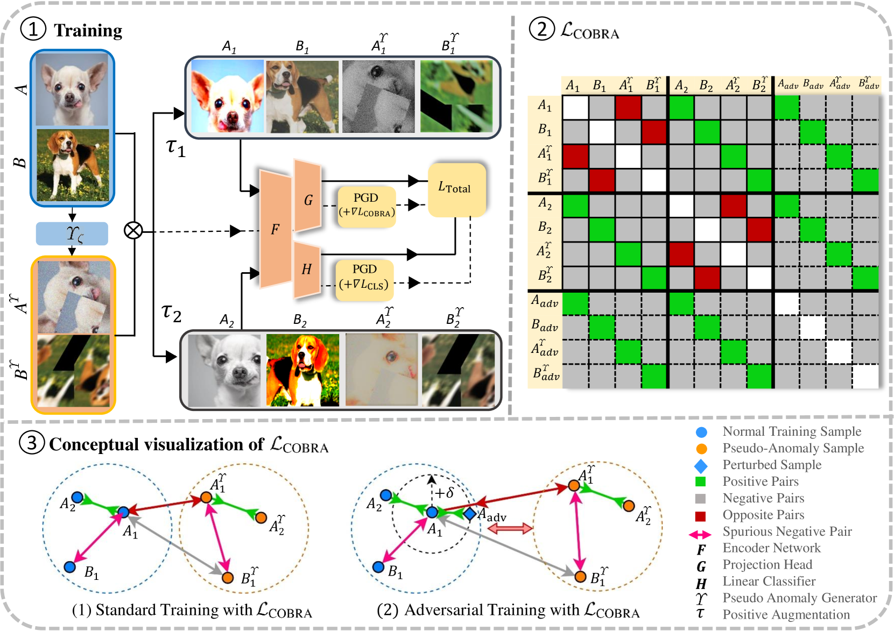

# Mitigating Spurious Negative Pairs for Robust Industrial Anomaly Detection

This repository contains the official PyTorch implementation of our ICLR 2025 paper:  
["**Mitigating Spurious Negative Pairs for Robust Industrial Anomaly Detection**"](https://arxiv.org/html/2501.15434v1)  
by [Hossein Mirzaie](), [Mojtaba Nafez](), [Jafar Habibi](), [Mohammad Sabokrou](), and [Mohammad Hossein Rohban]().

<p align="center">
    
</p>

---

## 🚀 Colab Notebook

For a quick start, try out our training and inference pipeline directly in Google Colab:  
👉 [Launch Colab Notebook](https://colab.research.google.com/drive/1q_eVTCpScKjsD90i7fMhHj2jaoo9BHhN?usp=sharing)

---

## 📁 Datasets

Below are the datasets used in our experiments:

- [MVTec AD Dataset](https://www.mydrive.ch/shares/38536/3830184030e49fe74747669442f0f282/download/420938113-1629952094/mvtec_anomaly_detection.tar.xz)
- ImageNet-30: [Train](https://drive.google.com/file/d/1B5c39Fc3haOPzlehzmpTLz6xLtGyKEy4/view), [Test](https://drive.google.com/file/d/13xzVuQMEhSnBRZr-YaaO08coLU2dxAUq/view)
- [VisA Dataset](https://www.kaggle.com/datasets/sorenasafari44/visa-ds?select=VisA)
- [DAGM Dataset](https://www.kaggle.com/datasets/ahmadsaeidi78/dagm-anomaly-detection)
- [ISIC 2018](https://www.kaggle.com/datasets/maxjen/isic-task3-dataset)


---

## 📦 Requirements

Install the required dependencies using:

```bash
pip install -r requirements.txt
```

---

## 🏋️‍♂️ Training

In the [Colab](https://colab.research.google.com/drive/1q_eVTCpScKjsD90i7fMhHj2jaoo9BHhN?usp=sharing) file, you can find the exact arguments used for both high and low-resolution datasets.

### 🔹 One-Class Anomaly Detection

To train a one-class anomaly detection model, run:

```bash
python train.py --train_time_adv_evaluate --train_time_clean_evaluate \
--one_class_idx $class_num --evaluate_save_step $evaluate_save_step \
--dataset $dataset --model $model --epochs $epochs --batch_size $batch_size \
--epsilon $train_epsilon
```

**Arguments:**
- `one_class_idx`: Specifies the in-distribution class for one-class training.
- `epsilon`: Controls PGD strength during training.

### 🔹 Unlabeled Multi-Class Anomaly Detection

To train our unlabeled multi-class setup (code & example coming soon):

```bash
# Coming soon
```

---

## 📊 Evaluation

In the [Colab](https://colab.research.google.com/drive/1q_eVTCpScKjsD90i7fMhHj2jaoo9BHhN?usp=sharing) file, you can find the exact arguments used for both high and low-resolution datasets.

* We provide pre-trained checkpoints for the COBRA model:  
🔗 [Download Checkpoints](https://drive.google.com/drive/folders/1p6FkGOWI78_1ZZpAVWBfP8alESug2k5P?usp=sharing)

### 🔹 One-Class Evaluation

```bash
python eval.py --out_attack --in_attack \
--one_class_idx $class_num --dataset $dataset --model $model \
--print_score --eps $eval_epsilon --load_path $model_path \
--batch_size $batch_size --test_batch_size $batch_size
```

**Options:**
- `out_attack`: Apply PGD-100 only on anomalous samples.
- `in_attack`: Apply PGD-100 only on normal samples.
- `one_class_idx`: Specifies the target class for evaluation.
- Use `resize_factor` and `resize_fix` to control cropping with `RandomResizedCrop()`.

### 🔹 Unlabeled Multi-Class Evaluation

```bash
# Coming soon
```

---

## 📌 Citation

If you find this work helpful, please consider citing:

```bibtex
@inproceedings{
mirzaei2025adversarially,
title={Adversarially Robust Anomaly Detection through Spurious Negative Pair Mitigation},
author={Hossein Mirzaei and Mojtaba Nafez and Jafar Habibi and Mohammad Sabokrou and Mohammad Hossein Rohban},
booktitle={The Thirteenth International Conference on Learning Representations},
year={2025},
url={https://openreview.net/forum?id=t8fu5m8R5m}
}
```
